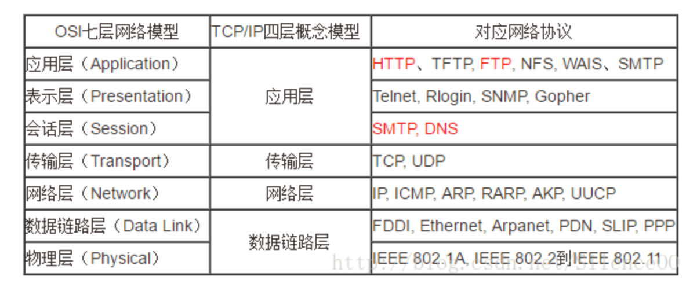

# DPDK🇨🇳🇨🇳🇨🇳

- Dpdk学习过程中记录下来的代码

### 主要功能

1. 通过dpdk实现传输层tcp和upd协议
2. 通过dpdk实现网络层arp和icmp协议

### 安装

https://runningfaster.github.io/2025-05-14-Dpdk%E5%AE%89%E8%A3%85/

### 启动命令
make && gdb ./build/send

### Code
upd收发包，arp-resp